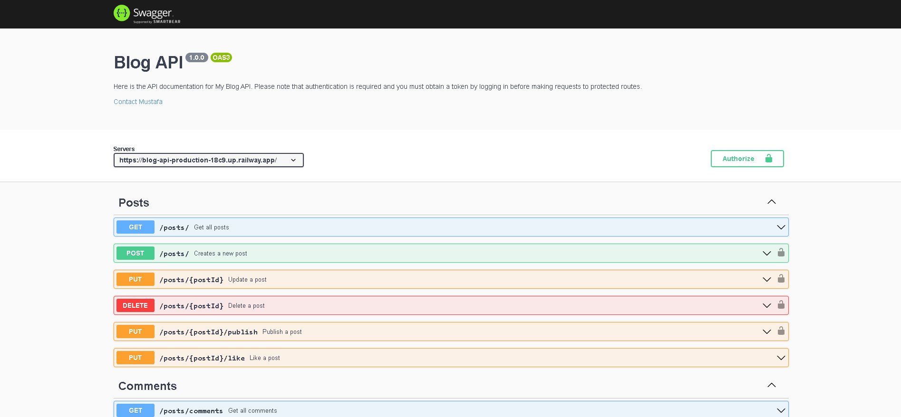

# Blog API

This project is the part of [nodejs](https://www.theodinproject.com/lessons/nodejs-blog-api) course on the odin projects full stack javascript cirriculum.
This project uses [SwaggerUI](https://swagger.io/) for API Documentation.

## Screenshot



  
## Demo

🔑 Token : Don't forget to log in and take your token to send request to protected routes

👉 See it live [here](https://blog-api-production-18c9.up.railway.app/)

  
## Features

- `User Authentication:` Users can create an account, login/logout securely, and access protected routes using a token-based authentication system.

- `View posts:` All users can view all published posts.

- `Create and manage posts:` Authorized users can create new posts, update existing posts, and delete posts that they have created.

- `Post categorization:` Users can categorize their posts based on tags for easy searching and sorting.

- `Commenting system:` All users can comment on posts and view other users comments.

- `Like system:` All users can like posts and comments.

- `Admin management:` Admins have editing, deleting and post publishing permissions and can give adminship to other users. Admins can also manage user accounts, and delete inappropriate posts or comments.


  
## Run project locally

Clone the project

```bash
  git clone https://github.com/mustafa-mun/blog-api.git
```

Go to the project directory

```bash
  cd blog-api
```

Install the required packages

```bash
  npm install
```

Start the server

```bash
  npm  start
```

  
